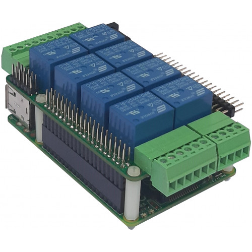

[](https://www.sequentmicrosystems.com)

# ioplus-rpi

This is the command to control [IO_PLUS Stackable Card for Raspberry Pi](https://sequentmicrosystems.com/index.php?route=product/product&product_id=42)



## Setup

Don't forget to enable I2C communication:
```bash
~$ sudo raspi-config
```

## Usage

```bash
~$ git clone https://github.com/SequentMicrosystems/ioplus-rpi.git
~$ cd ioplus-rpi/
~/ioplus-rpi$ sudo make install
```

Now you can access all the functions of the relays board through the command "ioplus". Use -h option for help:
```bash
~$ ioplus -h
```

If you clone the repository any update can be made with the following commands:

```bash
~$ cd ioplus-rpi/  
~/ioplus-rpi$ git pull
~/ioplus-rpi$ sudo make install
``` 

## [Firmware Update](update/README.md)

## [Python Library](python/README.md)

