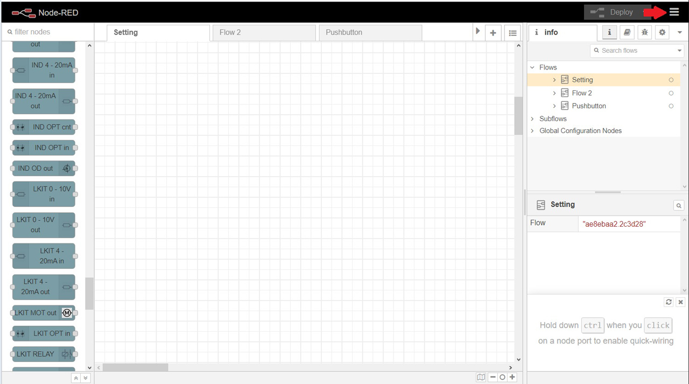
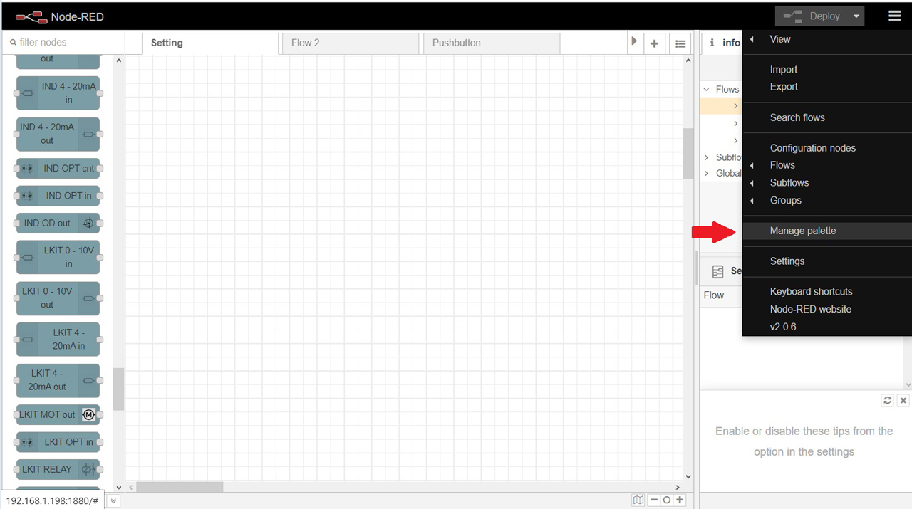
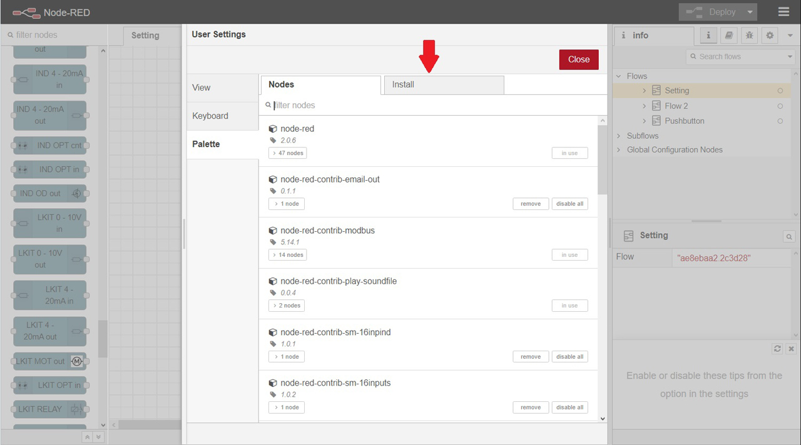
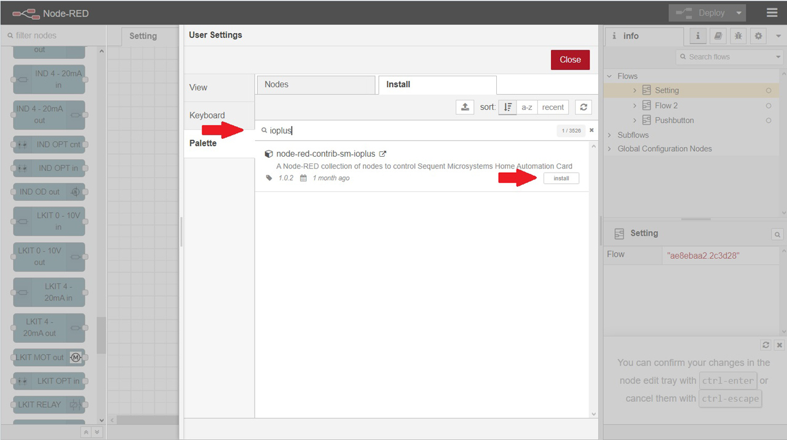

# node-red-contrib-sm-ioplus

The Node-RED nodes for the <a href="https://sequentmicrosystems.com/products/raspberry-pi-home-automation-card" target="_blank" rel="noopener">Home Automation card</a>

## Command line installation

For first time installation, clone the repository:
```bash
~$ git clone https://github.com/SequentMicrosystems/ioplus-rpi.git
```

If you already cloned the repository, update to the latest version:
```bash
$ cd /ioplus-rpi/  
~/ioplus-rpi$ git pull
```
Install the Node-RED nodes:
```bash
$ cd /.node-red
/.node-red$ npm install /ioplus-rpi/node-red-contrib-sm-ioplus
```
Restart the Node-RED service
```bash
~$ node-red-stop
~$ node-red-start
```

## Node-RED installation

On the Node-RED home screen click on the Menu icon on the top toolbar right corner:


then "Manage Palette":


then "Install" tab:


Search for "ioplus" and click "Install" again:


Sequent Microsystems nodes for the Home Automation card will be displayed on the Node-RED palette

## Usage


### IOPLUS RELAY

This node controls the relays of the card. Set the "relay" parameter to [1..8] to control one relay, or set it to 0 for all relays. The card stack level and relay number can be set in the node dialog box or dynamically through ```msg.stack``` and ```msg.relay```. The payload of the input message contains the state of one relay or an eight bit number with the state of all 8 relays.

### IOPLUS 0-10V out

This node controls one 0-10V output channel. The card stack level and channel number can be set in the node dialog box or dynamically through ```msg.stack``` and ```msg.channel```. The value in volts is set dynamically as a number between 0..10  through ```msg.payload```.

### IOPLUS ADC in

This node reads one analog input channel. The card stack level and channel number can be set in the node dialog box or dynamically through ```msg.stack``` and ```msg.channel```. Reading is triggered by the message input. The output can be found in the output message payload as a number representing the voltage.

### IOPLUS OPT cnt

This node reads the optically coupled input counter and sets the counting edges for one channel. The card stack level and channel number can be set in the node dialog box or dynamically through ```msg.stack``` and ```msg.channel```. Rising and/or falling edge counting can be enabled/diabled from the node dialog screen. Edge settings are sent to the card when the node is deployed, when the flow starts or a different channel is selected through ```msg.channel```. Reading is triggered by the message input. The output can be found in the output message payload as a number.

### IOPLUS OPT in

This node reads the state of one optically coupled input channel. The card stack level and channel number can be set in the node dialog box or dynamically through ```msg.stack``` and ```msg.channel```. Reading is triggered by the message input.  The output can be found in the output message payload as a boolean value.

### IOPLUS OD out

This node controls one open drain output channel. The card stack level and channel number can be set in the node dialog box or dynamically through ```msg.stack``` and ```msg.channel```. The value is set dynamically as a number between 0..100%through ```msg.payload```.

## Credits

This node is using the [I2C-bus package](https://github.com/fivdi/i2c-bus) from @fivdi. The inspiration for this node came from @nielsnl68 work with [node-red-contrib-i2c](https://github.com/nielsnl68/node-red-contrib-i2c). We thank them for the great job.

